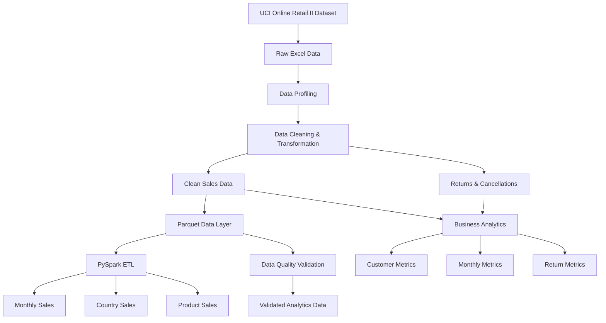

# E-Commerce Data Engineering Pipeline

An end-to-end data engineering pipeline built using **Python, PySpark, Pandas, Apache Parquet, and Pytest** to process, clean, validate, transform, and analyze the **UCI Online Retail II** dataset containing more than **1 million retail transaction records**.

The project demonstrates a complete data engineering workflow starting from raw Excel data ingestion and profiling, followed by data cleaning, scalable PySpark transformations, data quality validation, business analytics, automated testing, and pipeline orchestration design.

---

## 📌 Project Overview

Retail transaction datasets often contain duplicate records, missing values, cancelled transactions, invalid prices, and other data-quality issues.

This project builds a structured data pipeline to transform raw retail transaction data into clean, reliable, and analytics-ready datasets.

### The pipeline covers:

- Raw data ingestion and profiling
- Data quality investigation
- Duplicate detection and removal
- Invalid transaction handling
- Return and cancellation separation
- Revenue calculation
- Parquet-based data storage
- PySpark ETL processing
- Monthly revenue analysis
- Country-level sales analysis
- Product-level sales analysis
- Customer-level analytics
- Return/cancellation analytics
- Automated data quality validation
- Automated unit testing
- Apache Airflow DAG definition

---

# 🏗️ Architecture



---

# 🔄 End-to-End Data Flow

The pipeline follows the following workflow:

```text
Raw Excel Dataset
       ↓
Data Profiling
       ↓
Data Cleaning
       ↓
Sales / Returns Separation
       ↓
Parquet Storage
       ↓
PySpark ETL
       ↓
Aggregations
       ↓
Data Quality Validation
       ↓
Business Analytics
       ↓
Analytics-Ready Parquet Outputs
```

---

# 📊 Dataset

The project uses the **UCI Online Retail II** dataset.

The dataset contains online retail transaction information including:

| Column | Description |
|---|---|
| Invoice | Invoice / transaction identifier |
| StockCode | Product identifier |
| Description | Product description |
| Quantity | Number of units purchased |
| InvoiceDate | Transaction date and time |
| Price | Unit price |
| Customer ID | Customer identifier |
| Country | Customer country |

The dataset contains retail transactions covering the period from **2009 to 2011**.

The original dataset contains more than **1 million transaction records** across two Excel sheets.

---

# 🔍 1. Raw Data Profiling

Before modifying the dataset, a profiling process was implemented to understand the raw data and identify potential quality issues.

The profiling process checks:

- Number of records
- Number of columns
- Duplicate records
- Missing Customer IDs
- Missing product descriptions
- Invalid quantities
- Invalid prices
- Unique invoices
- Unique products
- Unique customers
- Unique countries
- Transaction date range
- Country distribution
- Sample records

This profiling step helps determine appropriate cleaning rules instead of blindly removing records.

---

# 🧹 2. Data Cleaning & Transformation

The raw dataset contains duplicate records, cancelled/returned transactions, missing values, and invalid prices.

The cleaning pipeline performs the following operations:

### Duplicate Handling

Exact duplicate transaction records are removed from the clean sales dataset.

### Return & Cancellation Handling

Transactions with:

```text
Quantity <= 0
```

are treated as return/cancellation records.

These records are **not simply deleted**. They are separated into a dedicated returns dataset so they can be analyzed independently.

### Invalid Price Handling

Transactions with:

```text
Price <= 0
```

are excluded from revenue-valid sales data.

### Missing Customer IDs

Customer IDs are not used as a mandatory requirement for overall transaction-level sales analytics.

Records with missing Customer IDs remain available for overall sales analysis, while customer-level analytics only use transactions where a Customer ID is available.

### Revenue Calculation

Transaction revenue is calculated as:

```text
Revenue = Quantity × Price
```

### Additional Attributes

The cleaned dataset also contains derived attributes such as:

- Year
- Month
- Day
- Weekday

---

# 📦 3. Parquet Data Layer

The cleaned datasets are stored using **Apache Parquet**.

Parquet was selected because it provides:

- Columnar storage
- Efficient analytical reads
- Compression
- Schema preservation
- Compatibility with PySpark
- Efficient processing for analytical workloads

The pipeline produces:

```text
retail_sales_clean.parquet
retail_returns.parquet
```

---

# ⚡ 4. PySpark ETL

PySpark is used for transformation and aggregation of the cleaned retail dataset.

The clean sales dataset contains:

**1,007,914 valid sales records**

PySpark processes the transaction data and produces multiple analytical datasets.

### Monthly Sales

Calculates:

- Total revenue
- Unique invoices
- Unique customers

grouped by:

```text
Year + Month
```

### Country Sales

Calculates:

- Total revenue
- Unique invoices
- Unique customers

grouped by country.

### Product Sales

Calculates:

- Total revenue
- Unique invoices

grouped by:

```text
Stock Code + Product Description
```

The aggregated results are stored as Parquet files.

---

# 🧪 5. Data Quality Validation

A dedicated automated data-quality validation layer was implemented.

The following checks are performed:

| Validation | Expected Result |
|---|---:|
| Record count | Greater than 0 |
| Duplicate rows | 0 |
| Missing invoice | 0 |
| Missing stock code | 0 |
| Invalid quantity | 0 |
| Invalid price | 0 |
| Missing invoice date | 0 |
| Revenue calculation mismatch | 0 |

### Current Result

**8 / 8 data quality checks passed ✅**

The validation process generates:

```text
data/processed/data_quality_report.csv
```

---

# 📈 6. Business Analytics

After the ETL and validation stages, a business analytics layer generates analytical datasets.

## Customer Analytics

Customer-level metrics include:

- Total revenue
- Total orders
- Total items purchased
- Average order value
- First purchase date
- Last purchase date
- Customer lifetime duration

The customer analytics dataset helps identify high-value customers and understand purchasing behavior.

---

## Monthly Analytics

Monthly metrics include:

- Total revenue
- Total orders
- Total items
- Unique customers
- Average order value

This enables analysis of revenue trends and monthly business performance.

---

## Return Analytics

Return/cancellation metrics include:

- Return transactions
- Returned items
- Return value

This allows return behavior to be analyzed separately from valid sales.

---

# 📊 Key Results

The completed pipeline successfully processed:

| Metric | Result |
|---|---:|
| Clean sales records | **1,007,914** |
| Return / cancellation records | **22,496** |
| Total clean sales revenue | **£20,476,634.02** |
| Data quality checks | **8 / 8 passed** |
| Automated tests | **5 / 5 passed** |

The pipeline generates analytical outputs for:

- Monthly revenue trends
- Country performance
- Product performance
- Customer revenue
- Average order value
- Return and cancellation trends

---

# 🧪 Automated Testing

The project includes automated tests using **Pytest**.

The test suite validates:

- Data quality validation logic
- Customer metric calculations
- Monthly metric calculations
- Return metric calculations
- Empty return-data handling

### Test Result

```text
5 passed
```

Run the tests using:

```bash
pytest -v
```

---

# 🔄 Pipeline Orchestration

An Apache Airflow DAG is included to define the dependency between the major pipeline tasks.

The defined workflow is:

```text
Clean Data
    ↓
Spark ETL
    ↓
Data Quality Checks
    ↓
Business Analytics
```

The repository currently contains the **Airflow DAG definition**.

A production Airflow deployment is planned as a future enhancement.

---

# 🛠️ Technology Stack

| Category | Technology |
|---|---|
| Programming Language | Python 3.11 |
| Distributed Processing | PySpark 3.5.6 |
| Data Analysis | Pandas 2.2.3 |
| Storage Format | Apache Parquet |
| Parquet Engine | PyArrow 18.1.0 |
| Testing | Pytest 8.3.4 |
| Orchestration Design | Apache Airflow DAG |
| Version Control | Git / GitHub |
| Development Environment | VS Code |

---

# 📁 Project Structure

```text
ecommerce-data-engineering/
│
├── data/
│   ├── raw/
│   │   └── online+retail+ii/
│   │
│   └── processed/
│       ├── retail_sales_clean.parquet
│       ├── retail_returns.parquet
│       ├── data_quality_report.csv
│       │
│       ├── spark/
│       │   ├── monthly_sales.parquet
│       │   ├── country_sales.parquet
│       │   └── product_sales.parquet
│       │
│       └── analytics/
│           ├── customer_metrics.parquet
│           ├── monthly_metrics.parquet
│           └── return_metrics.parquet
│
├── src/
│   │
│   ├── ingestion/
│   │   └── profile_raw_data.py
│   │
│   ├── transformation/
│   │   ├── clean_retail_data.py
│   │   ├── spark_etl.py
│   │   ├── data_quality.py
│   │   └── __init__.py
│   │
│   └── analytics/
│       ├── customer_analytics.py
│       └── __init__.py
│
├── dags/
│   └── ecommerce_pipeline.py
│
├── tests/
│   └── test_pipeline.py
│
├── requirements.txt
├── .gitignore
└── README.md
```

> **Note:** The raw dataset is excluded from Git version control using `.gitignore`.

---

# 🚀 Installation

## Clone the Repository

```bash
git clone https://github.com/jemmiii/ecommerce-data-engineering.git
cd ecommerce-data-engineering
```

## Create a Virtual Environment

```bash
python -m venv venv
```

## Activate the Virtual Environment

### Windows

```powershell
venv\Scripts\Activate.ps1
```

## Install Dependencies

```bash
pip install -r requirements.txt
```

---

# ▶️ Running the Pipeline

## 1. Profile Raw Data

```bash
python src/ingestion/profile_raw_data.py
```

## 2. Clean the Dataset

```bash
python src/transformation/clean_retail_data.py
```

## 3. Run PySpark ETL

```bash
python src/transformation/spark_etl.py
```

## 4. Run Data Quality Validation

```bash
python src/transformation/data_quality.py
```

## 5. Generate Business Analytics

```bash
python src/analytics/customer_analytics.py
```

## 6. Run Automated Tests

```bash
pytest -v
```

---

# 📦 Generated Outputs

The pipeline generates the following processed datasets:

```text
data/processed/
│
├── retail_sales_clean.parquet
├── retail_returns.parquet
├── data_quality_report.csv
│
├── spark/
│   ├── monthly_sales.parquet
│   ├── country_sales.parquet
│   └── product_sales.parquet
│
└── analytics/
    ├── customer_metrics.parquet
    ├── monthly_metrics.parquet
    └── return_metrics.parquet
```

---

# 💡 Engineering Practices Demonstrated

This project demonstrates practical data engineering concepts including:

- ETL pipeline design
- Data profiling
- Data cleaning and transformation
- Handling of invalid and cancelled transactions
- Distributed processing with PySpark
- Columnar data storage using Parquet
- Data quality validation
- Business-oriented analytics
- Automated testing
- Pipeline dependency design
- Git-based version control
- Modular Python project structure

---

# 🎯 What This Project Demonstrates

The project demonstrates the ability to take a large, imperfect dataset and turn it into a structured analytics-ready data pipeline.

The main engineering workflow is:

```text
Understand the Data
       ↓
Profile the Data
       ↓
Define Data Quality Rules
       ↓
Clean & Transform
       ↓
Store in Parquet
       ↓
Process with PySpark
       ↓
Validate Results
       ↓
Generate Business Metrics
       ↓
Test the Pipeline
       ↓
Define Orchestration
```

---

# 🔮 Future Improvements

The following capabilities can be added to extend the pipeline toward a production cloud data engineering architecture:

- AWS S3 data lake integration
- AWS EMR or AWS Glue processing
- Production Apache Airflow deployment
- Incremental data processing
- Partitioned Parquet datasets
- Spark SQL analytics
- Data warehouse integration
- Pipeline monitoring and observability
- Automated CI/CD pipeline
- Cloud-based data quality monitoring

---

# 👨‍💻 Author

## Jemin Patidar

B.Tech in Information Technology  
Manipal University Jaipur

**GitHub:**  
https://github.com/jemmiii

**Portfolio:**  
https://jeminpatidar-portfolio.vercel.app/

---

## ⭐ Project Highlights

**1M+** retail records processed  
**1,007,914** clean sales records  
**22,496** return/cancellation records  
**8/8** data quality checks passed  
**5/5** automated tests passed  
**PySpark** ETL processing  
**Parquet** analytical storage  
**Airflow DAG** orchestration design
